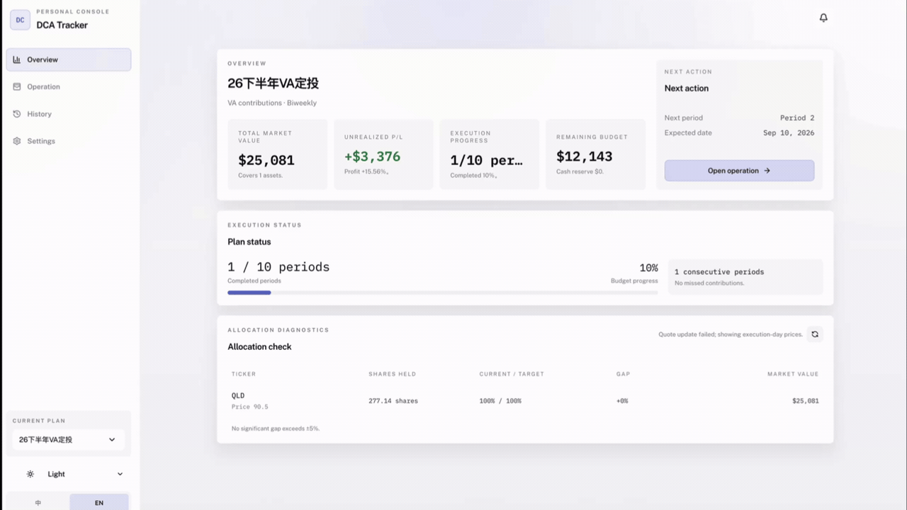
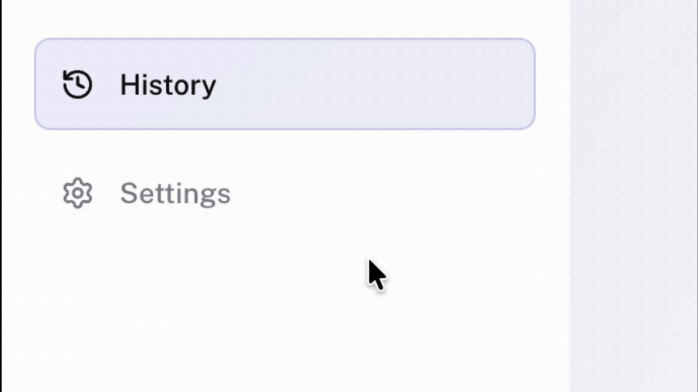

# DCA Tracker

A dollar-cost averaging tracker designed for US stock investors. Supports traditional DCA (fixed amount) and VA (value averaging) strategies, with local data storage and no registration required.

**[🌐 Live Demo](https://dca.020023.xyz/)** • **[Alternative (VPN required)](https://dca-tracker-steel.vercel.app)**

---

## Why This Tool

If you're dollar-cost averaging in the US stock market, you need to track prices, calculate shares, and monitor returns for each period. Traditional spreadsheets quickly become unwieldy. DCA Tracker automates this:

- **Precise VA Calculations**: Automatically calculates investment amounts based on target path
- **Flexible Budget Modes**: Fixed total budget split across periods, or continuous investment
- **Local Data Storage**: All data saved in browser, no server uploads, full privacy control
- **One-Click Deploy**: Deploy to Vercel in 3 minutes with zero configuration



---

## Quick Start

### Online Use (Recommended)

Visit [https://dca.020023.xyz/](https://dca.020023.xyz/) directly—no installation needed.

### Local Development

```bash
git clone https://github.com/Fe1ix-deng/dca-tracker.git
cd dca-tracker
npm install
npm run dev
```

Visit `http://localhost:5173` to start using.

### Deploy to Vercel

[](https://vercel.com/new/clone?repository-url=https://github.com/Fe1ix-deng/dca-tracker)

Click the button above—Vercel will automatically fork the repo and complete deployment in under 3 minutes.

---

## Core Features

### Dual Strategy Support

**DCA (Dollar-Cost Averaging)**: Invest fixed amount each period

```
Period 1: Invest $1000
Period 2: Invest $1000
Period 3: Invest $1000
...
```

**VA (Value Averaging)**: Dynamically adjust investment based on target value path

```
Target: Period n value = $1000 × n
Period 1: Target $1000, current $0, invest $1000
Period 2: Target $2000, current $1100 (market up), invest $900
Period 3: Target $3000, current $1800 (market down), invest $1200
```

### Flexible Budget Management

- **Fixed Budget Mode**: Set total budget $10,000, split across 10 periods
- **Unlimited Mode**: Continuous periodic investment with no end date

### Multi-Asset Portfolio

```javascript
// Example configuration
[
  { ticker: 'QQQ', weight: 60%, currentShares: 0 },
  { ticker: 'VOO', weight: 40%, currentShares: 0 }
]
// System auto-allocates investment by weight
```

### Auto Price Fetching (Optional)

Configure Twelve Data API Key to auto-fetch latest prices. Falls back to manual input if unavailable—core functionality unaffected.

```bash
# .env file
TWELVE_DATA_API_KEY=your_api_key_here
```

Get free API key at [Twelve Data](https://twelvedata.com/).

### Visualization



- **Portfolio Trajectory**: Compare actual vs target value path
- **Allocation Analysis**: Real-time weight deviation from targets
- **Investment Rhythm**: Track period-by-period investment amounts
- **Key Metrics**: Total value, cumulative investment, P&L, remaining budget

### Data Export & Backup

- **CSV Export**: Export all records in Excel-compatible format
- **JSON Export**: Full backup of plans and history
- **JSON Import**: Restore from backup after switching devices

---

## Usage Flow

### 1. Create First Plan

Go to **Settings** page and fill in:

- Plan name: `2026 US Stock VA`
- Budget mode: `Fixed Budget` or `Unlimited`
- Strategy: `VA` or `DCA`
- Total budget: `$10,000` (for fixed mode)
- Total periods: `10`
- Frequency: `Biweekly` or `Monthly`

Click **Add Asset** and configure:

```
QQQ  |  Nasdaq ETF  |  60%  |  Current shares: 0
VOO  |  S&P ETF     |  40%  |  Current shares: 0
```

Ensure weights sum to 100%, then click **Save Plan**.

### 2. Record Current Period

Go to **Operation** page:

1. Enter current price for each asset (manual or auto-fetch)
2. Review suggested investment amount and shares
3. Enter actual shares purchased
4. Select decision tag: `Normal` / `Reduced` / `Skipped`
5. Add note (e.g., "Nasdaq dip, executed as planned")
6. Click **Confirm Period Record**

### 3. View Overview & History

- **Overview**: View core metrics, trajectory chart, allocation, rhythm
- **History**: Expand period details, edit, delete, export

---

## Technical Highlights

### Frontend Architecture

- **React 18 + Vite**: Fast dev server with HMR, 10x faster builds
- **Tailwind CSS**: Atomic CSS system, zero unused styles
- **Recharts**: Data visualization with responsive & custom themes

### Data Persistence

All data stored in browser `localStorage`, no backend required:

```javascript
// Example data structure
{
  plans: [
    {
      id: "plan_001",
      name: "2026 US Stock VA",
      strategy: "VA",
      budgetMode: "FIXED",
      assets: [...]
    }
  ],
  records: [
    {
      planId: "plan_001",
      period: 1,
      date: "2026-09-04",
      assets: [...]
    }
  ]
}
```

### Smart Fallback

Price fetch failures auto-fallback to manual input:

```javascript
// Pseudo-code
try {
  price = await fetchFromAPI(ticker)
} catch {
  price = userManualInput()  // Auto fallback
}
```

### Stock Split Handling

Automatic handling of stock splits (e.g., QLD 1:2 split):

- Retroactively adjust historical shares and prices
- Recalculate average cost
- Preserve original records, provide adjusted view on export

### Internationalization

Built-in Chinese/English interface switching via React Context:

```javascript
const { t, language, setLanguage } = useI18n()
// One-click language switch, all text auto-updates
```

---

## FAQ

### Is my data safe?

All data is stored locally in your browser, never uploaded to any server. We recommend periodic JSON backups via the History page.

### Does it support Chinese A-shares?

Supports A-share ticker recognition (e.g., 600519.SS), but auto-fetch only works for US stocks. A-share users can manually enter prices.

### Will I lose data when switching devices?

Data is browser-local. Export JSON backup before switching, then import on new device.

### Can I manage multiple plans?

Yes. The plan dropdown at the top supports creating and switching between independent plans.

---

## Tech Stack

| Technology | Version | Purpose |
|------------|---------|---------|
| React | 18.3.1 | Frontend framework |
| Vite | 7.1.3 | Build tool |
| Tailwind CSS | 3.4.17 | Styling |
| Recharts | 3.1.2 | Charts |
| Lucide React | 0.542.0 | Icons |
| Vitest | 3.2.4 | Testing |

---

## Development

```bash
# Install dependencies
npm install

# Start dev server
npm run dev

# Run tests
npm run test

# Build for production
npm run build

# Preview production build
npm run preview
```

---

## Contributing

Issues and Pull Requests welcome! Please ensure:

- Code follows project style
- Include necessary unit tests
- Update relevant documentation

---

## License

[MIT License](./LICENSE)

---

## Contact

- GitHub: [@Fe1ix-deng](https://github.com/Fe1ix-deng)
- Issues: [GitHub Issues](https://github.com/Fe1ix-deng/dca-tracker/issues)

---

If this project helps you, please give it a ⭐ Star!
